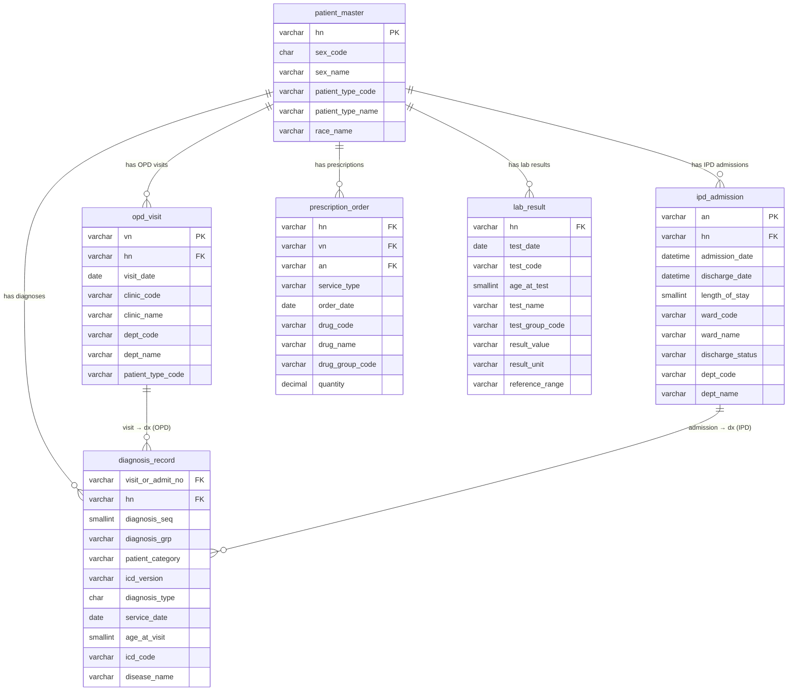

# Siriraj Hospital — Data Dictionary & ER Diagram

**Original file:** `Safe_DataSet.xlsx`
**Suggested rename:** `siriraj_clinical_data_dictionary.xlsx`

> This file documents 6 active sheets.
> Source DB: `[SiIMC_MGHT]` (SQL Server / SAP BW)

---

## Table Index

| # | Original Sheet Name | Suggested Table Name | Domain |
|---|---|---|---|
| 1 | 1. Patient_Info | `patient_master` | Clinical |
| 2 | 2. patient_Visit | `opd_visit` | Clinical |
| 3 | 3. diagnosis_opd_ipd | `diagnosis_record` | Clinical |
| 4 | 4. รายละเอียดข้อมูลคนไข้ใน IPD | `ipd_admission` | Clinical |
| 5 | 5. PHARM_DATA_OPDIPD_SIOPEHIS | `prescription_order` | Pharmacy |
| 6 | 6. HCLAB | `lab_result` | Laboratory |

---

## 1. `patient_master` (Patient_Info)

**EN:** Master record of all registered patients at Siriraj Hospital.
**TH:** ข้อมูลหลักของผู้ป่วยทุกรายที่ลงทะเบียนกับโรงพยาบาลศิริราช

Source: `[SiIMC_MGHT].[da].[INTO_Patient_Info_Archive]`

| Field | Suggested Name | EN Description | TH Description | Type | Key |
|---|---|---|---|---|---|
| `hn` | `hn` | Hospital Number — unique patient identifier | เลขประจำตัวผู้ป่วยโรงพยาบาล | `VARCHAR(20)` | **PK** |
| `sex_code` | `sex_code` | Gender code | รหัสเพศ | `CHAR(1)` | |
| `sex_name` | `sex_name` | Gender label (incl. unspecified) | คำแปลเพศ (รวมไม่ระบุเพศ) | `VARCHAR(20)` | |
| `patient_type` | `patient_type_code` | Insurance/payment scheme code | รหัสสิทธิ์การรักษา | `VARCHAR(20)` | |
| `patient_type_name` | `patient_type_name` | Insurance/payment scheme name | ชื่อสิทธิ์การรักษา (30บาท/ประกันสังคม/จ่ายเอง/กรมบัญชีกลาง) | `VARCHAR(100)` | |
| `race_name` | `race_name` | Nationality label (Thai / Foreign) | คำแปลเชื้อชาติ (ไทย/ต่างชาติ) | `VARCHAR(50)` | |

---

## 2. `opd_visit` (patient_Visit)

**EN:** OPD visit records — one row per visit/encounter opened at any outpatient clinic.
**TH:** ข้อมูลการเปิด Visit ของผู้ป่วยนอก (OPD) แต่ละครั้งที่มารับบริการ

Source: `[SiIMC_MGHT].[dbo].[T_out_patient_visit_details_info_for_AllDept]`

| Field | Suggested Name | EN Description | TH Description | Type | Key |
|---|---|---|---|---|---|
| `vn` | `vn` | Visit Number — unique OPD visit identifier | รหัส Visit ที่สร้างเมื่อเปิดการรับบริการ OPD | `VARCHAR(30)` | **PK** |
| `hn` | `hn` | Hospital Number | เลขประจำตัวผู้ป่วย | `VARCHAR(20)` | **FK → patient_master.hn** |
| `visit_date` | `visit_date` | Date of service | วันที่มารับบริการ | `DATE` | |
| `clinic_code` | `clinic_code` | Clinic code | รหัสคลินิกที่มารับบริการ | `VARCHAR(20)` | |
| `clinic_name` | `clinic_name` | Clinic name | ชื่อคลินิก | `VARCHAR(100)` | |
| `patient_type` | `patient_type_code` | Insurance scheme code at time of visit | รหัสสิทธิ์ ณ เวลาเปิด VN | `VARCHAR(20)` | |
| `patient_type_name` | `patient_type_name` | Insurance scheme name | ชื่อสิทธิ์ | `VARCHAR(100)` | |
| `dept_code` | `dept_code` | Department code | รหัสภาควิชา | `VARCHAR(20)` | |
| `dept_name` | `dept_name` | Department name | ชื่อภาควิชา | `VARCHAR(100)` | |
| `sub_dept_code` | `sub_dept_code` | Sub-department / branch code | รหัสสาขาหน่วยงาน | `VARCHAR(20)` | |
| `สาขา` | `sub_dept_name` | Branch name | ชื่อสาขา | `VARCHAR(100)` | |

---

## 3. `diagnosis_record` (diagnosis_opd_ipd)

**EN:** Diagnosis codes (ICD-10/ICD-9) for both OPD visits and IPD admissions.
**TH:** ข้อมูลรหัสวินิจฉัยโรค (ICD-10/ICD-9) ของผู้ป่วยทั้ง OPD และ IPD

Source: `[SiIMC_MGHT].[dbo].[INTO_diagnosis_opd_ipd_Archive]`

> No single-column PK. Composite key: (`anORvn`, `final_seq`, `final_grp`)

| Field | Suggested Name | EN Description | TH Description | Type | Key |
|---|---|---|---|---|---|
| `anORvn` | `visit_or_admit_no` | VN (OPD) or AN (IPD) — visit/admission identifier | รหัส VN (OPD) หรือ AN (IPD) | `VARCHAR(30)` | **PK (composite)**, FK → opd_visit.vn / ipd_admission.an |
| `hn` | `hn` | Hospital Number | เลขประจำตัวผู้ป่วย | `VARCHAR(20)` | **FK → patient_master.hn** |
| `ipdORopd` | `patient_category` | Patient type: IPD or OPD | ประเภทผู้ป่วย (IPD/OPD) | `VARCHAR(5)` | |
| `icd10ORicd9` | `icd_version` | ICD version used | ประเภทรหัส (ICD10/ICD9) | `VARCHAR(5)` | |
| `final_type` | `diagnosis_type` | Diagnosis role: O=Original, T=Transfer, D=Discharge | ประเภทการวินิจฉัย (O/T/D) | `CHAR(1)` | |
| `adm_dateORvisit_date` | `service_date` | Admission date (IPD) or visit date (OPD) | วันที่ Admit หรือวันที่รับบริการ OPD | `DATE` | |
| `age` | `age_at_visit` | Patient age at time of service | อายุ ณ วันที่มารับบริการ | `SMALLINT` | |
| `final_seq` | `diagnosis_seq` | Sequence: primary vs. secondary diagnosis | ลำดับโรคหลัก/โรคแทรกซ้อน | `SMALLINT` | **PK (composite)** |
| `final_grp` | `diagnosis_grp` | Sub-sequence group (G1) | กลุ่มย่อย (G1) | `VARCHAR(10)` | **PK (composite)** |
| `final_code` | `icd_code` | ICD-10 or ICD-9 code | รหัส ICD | `VARCHAR(20)` | |
| `disease_name` | `disease_name` | ICD code description | คำอธิบายรหัสโรค | `VARCHAR(200)` | |

---

## 4. `ipd_admission` (รายละเอียดข้อมูลคนไข้ใน IPD)

**EN:** Inpatient (IPD) admission records — one row per hospital admission episode.
**TH:** ข้อมูลรายละเอียดการ Admit ของผู้ป่วยใน (IPD) แต่ละครั้ง

Source: `[SiIMC_MGHT]` (IPD archive table)

| Field | Suggested Name | EN Description | TH Description | Type | Key |
|---|---|---|---|---|---|
| `an` | `an` | Admission Number — unique IPD episode identifier | รหัส Admit ของผู้ป่วยใน | `VARCHAR(30)` | **PK** |
| `hn` | `hn` | Hospital Number | เลขประจำตัวผู้ป่วย | `VARCHAR(20)` | **FK → patient_master.hn** |
| `admission_date` | `admission_date` | Date and time admitted | วันและเวลาที่รับ Admit | `DATETIME` | |
| `discharge_date` | `discharge_date` | Date and time discharged | วันและเวลาที่จำหน่าย | `DATETIME` | |
| `LOS` | `length_of_stay` | Length of stay in days (Discharge − Admit) | จำนวนวันนอน (DC − Admit) | `SMALLINT` | |
| `ward_number` | `ward_code` | Ward code | รหัส Ward | `VARCHAR(20)` | |
| `ward_name` | `ward_name` | Ward name | ชื่อ Ward | `VARCHAR(100)` | |
| `สถานะการจำหน่าย` | `discharge_status` | Discharge status (e.g., recovered, deceased, transferred) | สถานะการจำหน่าย | `VARCHAR(50)` | |
| `dept_code` | `dept_code` | Department code | รหัสภาควิชา | `VARCHAR(20)` | |
| `dept_name` | `dept_name` | Department name | ชื่อภาควิชา | `VARCHAR(100)` | |
| `ประเภทคลิกนิก` | `clinic_type` | Clinic type: in-hours / after-hours / elderly center | ประเภทคลินิก (ในเวลา/นอกเวลา/ศูนย์ผู้สูงอายุ) | `VARCHAR(50)` | |
| `Front Patient Group Description` | `insurance_label_front` | Insurance scheme name (front-office display) | ชื่อสิทธิ์มุมมอง Front | `VARCHAR(100)` | |
| `SAP Patient Group Description` | `insurance_label_sap` | Insurance scheme name (SAP/billing display) | ชื่อสิทธิ์มุมมอง SAP | `VARCHAR(100)` | |

---

## 5. `prescription_order` (PHARM_DATA_OPDIPD_SIOPEHIS)

**EN:** Medication orders dispensed for both OPD and IPD patients.
**TH:** ข้อมูลการสั่งจ่ายยาสำหรับผู้ป่วยทั้ง OPD และ IPD

Source: `[SiIMC_MGHT].[dbo].[INTO_PHARM_DATA_ARCHIVE_AGG]`

> No single-column PK. Composite key: (`HN`, `VN`/`AN`, `pharm_code`, `order_date`)

| Field | Suggested Name | EN Description | TH Description | Type | Key |
|---|---|---|---|---|---|
| `HN` | `hn` | Hospital Number | เลขประจำตัวผู้ป่วย | `VARCHAR(20)` | **FK → patient_master.hn** |
| `VN` | `vn` | Visit Number (OPD) | รหัส Visit (OPD) | `VARCHAR(30)` | **FK → opd_visit.vn** |
| `AN` | `an` | Admission Number (IPD) | รหัส Admit (IPD) | `VARCHAR(30)` | **FK → ipd_admission.an** |
| `Type` | `service_type` | Encounter type: OPD / eHIS / IPD | ประเภทการรับบริการ | `VARCHAR(10)` | |
| `order_date` | `order_date` | Date medication was ordered | วันที่สั่งจ่ายยา | `DATE` | |
| `pharm_code` | `drug_code` | Drug/item code (also SAP code) | รหัสยา / รหัส SAP | `VARCHAR(30)` | |
| `drug_name` | `drug_name` | Drug name | ชื่อยา | `VARCHAR(200)` | |
| `generic_id` | `drug_group_code` | Generic drug group code | รหัสกลุ่มยา | `VARCHAR(30)` | |
| `generic_name` | `drug_group_name` | Generic drug group name | ชื่อกลุ่มยา | `VARCHAR(200)` | |
| `LABEL_NAME_FREE` | `dosage_instruction` | Dosage / administration label | ขนาดและวิธีรับประทาน | `VARCHAR(500)` | |
| `qty` | `quantity` | Quantity dispensed | จำนวนที่สั่งจ่าย | `DECIMAL(10,2)` | |

---

## 6. `lab_result` (HCLAB)

**EN:** Laboratory test results for patients sent from any clinic.
**TH:** ผลการตรวจทางห้องปฏิบัติการของผู้ป่วยที่ส่งตรวจจากทุกคลินิก

Source: `[SiIMC_MGHT].[dbo].[INTO_HCLAB_Full_Join_Archive]`

> No single-column PK. Composite key: (`OH_PID`, `DATE_OH_TRX_DT`, `OD_TESTCODE`)

| Field | Suggested Name | EN Description | TH Description | Type | Key |
|---|---|---|---|---|---|
| `OH_PID` | `hn` | Hospital Number (patient ID in lab system) | เลขประจำตัวผู้ป่วยในระบบ Lab | `VARCHAR(20)` | **FK → patient_master.hn** |
| `DATE_OH_TRX_DT` | `test_date` | Date specimen was sent (time stripped) | วันที่ส่งตรวจ (ตัด time ออก) | `DATE` | |
| `OH_AGE_YY` | `age_at_test` | Patient age at test date | อายุ ณ วันที่ส่งตรวจ | `SMALLINT` | |
| `CLINIC_DESC` | `referring_clinic` | Clinic that ordered the test | คลินิกที่ส่งตรวจ | `VARCHAR(100)` | |
| `CTYPE_DESC` | `patient_category` | Patient type (OPD/IPD) | ประเภทผู้ป่วย | `VARCHAR(20)` | |
| `OH_LS_CODE` | `lab_dept_code` | Lab department code | รหัสภาควิชาห้องปฏิบัติการ | `VARCHAR(20)` | |
| `LAB_TEST_LOCATION` | `lab_dept_name` | Lab department description | ชื่อภาควิชาห้องปฏิบัติการ | `VARCHAR(100)` | |
| `OD_TESTCODE` | `test_code` | Test item code | รหัสรายการทดสอบ | `VARCHAR(30)` | |
| `TEST_NAME` | `test_name` | Test item name | ชื่อรายการทดสอบ | `VARCHAR(200)` | |
| `OD_TEST_GRP` | `test_group_code` | Test group code | รหัสกลุ่มการทดสอบ | `VARCHAR(20)` | |
| `TEST_GROUP_NAME` | `test_group_name` | Test group name | ชื่อกลุ่มการทดสอบ | `VARCHAR(100)` | |
| `OD_TR_VAL` | `result_value` | Test result value (may be text or numeric) | ผลการทดสอบ | `VARCHAR(100)` | |
| `OD_TR_UNIT` | `result_unit` | Unit of measurement | หน่วยวัด | `VARCHAR(50)` | |
| `OD_TR_RANGE` | `reference_range` | Normal/reference range | ช่วงอ้างอิง/เกณฑ์ปกติ | `VARCHAR(100)` | |

---

## ER Diagram

---

## Key Relationships Summary

| Relationship | From | To | Join Key |
|---|---|---|---|
| Patient → OPD Visits | `patient_master` | `opd_visit` | `hn` |
| Patient → IPD Admissions | `patient_master` | `ipd_admission` | `hn` |
| Patient → Diagnoses | `patient_master` | `diagnosis_record` | `hn` |
| Patient → Prescriptions | `patient_master` | `prescription_order` | `hn` (HN) |
| Patient → Lab Results | `patient_master` | `lab_result` | `hn` = `OH_PID` |
| Patient → Incidents | `patient_master` | `incident_report` | `hn` = `HN#ผู้ป่วย` |
| OPD Visit → Diagnoses | `opd_visit` | `diagnosis_record` | `vn` = `anORvn` |
| IPD Admission → Diagnoses | `ipd_admission` | `diagnosis_record` | `an` = `anORvn` |
| OPD Visit → Prescriptions | `opd_visit` | `prescription_order` | `vn` = `VN` |
| IPD Admission → Prescriptions | `ipd_admission` | `prescription_order` | `an` = `AN` |

---

## Notes

- **`hn` is the central patient key** linking all clinical tables.
- **`vn`** links OPD visits to prescriptions and diagnoses; **`an`** does the same for IPD.
- `diagnosis_record.anORvn` is a **unified field** — query with `ipdORopd` filter to split OPD vs. IPD.
